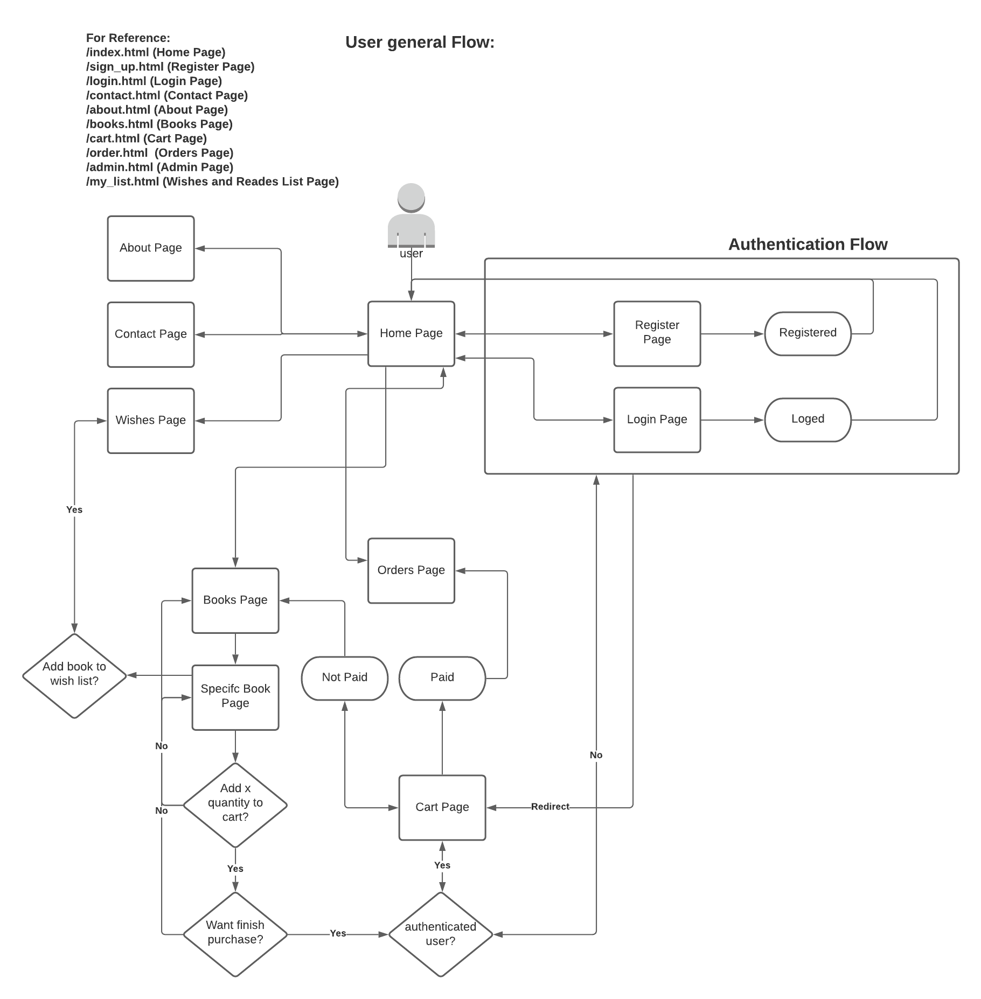

# OnlineStore-WebDevClassroom

Final project of Introduction to Web development classroom - SCC0219, where will be implemented a bookstore.

## Group

---

**Group 19**:
| **Nome Completo** | **N°USP** | **e-mail** |
|-----------------------------------|--------------|--------------------------|
| Fabio Dias da Cunha | 11320874 | fabiodias11@usp.br |
| Lucas Gabriel de Araujo Silva | 11218880 | lucasgasilva@usp.br |
| Thiago Sena de Queiroz | 11218768 | thiagosdq@usp.br |

## Functional Requirements

---

- The system must have 2 types of users: Clients and Administrators:
  - Administrators are responsible for registering/managing administrators, customers, and products/services provided. The application already comes with an account admin with password admin.
  - Customers are users who access the system to buy products/services.
- The admin record includes, at least: name, id, phone, email.
- Each customer's record includes, at least: name, id, address, phone, email
- Product/services records include, at least: name, id, photo, description, price, quantity (in stock), quantity sold.
- Your store may sell products, services or both (you decide)
- Selling Products (or services): Products are selected, their quantity chosen, and are included in a cart. Products are purchased using a credit card number (any number is accepted by the system). The quantity of product sold is subtracted from the quantity in stock and added to the quantity sold. Carts are emptied only on payment or by customers.
- Product/Service Management: Administrators can create/update/read/delete (crud) new products and services. For example, they can change the stock quantity.
- The books record includes, at least: name, authors, price, quantity, editors
- User can create/update/read/delete (crud) a list of book wishs and readeaded.
- Books has avaliation stars, that are ranked by users avaliations.
- The system must provide accessibility requirements and provide good usability. The system must be responsive.

# Project Report

## Technical requirements

- Node: 16.3.0v
- Linux: 20.04
- Server MongoDB Community: (Version: 5.0.1,Platform: Ubuntu 20.04, Package: server) -> https://www.mongodb.com/try/download/community

## Description

---

The project will implement a bookstore, that seel only books. Users can create account, buy books, control orders, make wishes and read lists.

The user general navigation flow, can be viwed on image:

---

### functionalities

---

Admin Page: Admin user can crud on users ,books and contacts

Contact Page: User can send Contact request forms

Wishes Page: User can crud wishes list

About Page: Nothing

Home Page: Nothing

Register Page: Anonymous user can create an account

Login Page: Existig user can authenticate in account

Orders Page: Authenticated user can see orders

Books Page: Nothing

Specif Book Page: User can add "x" quantity to cart and add or remove book from wishes list

Cart Page: User can end and pay a purchase or clean books in cart

## About the Code and Progress

---

- [x] Signup
- [x] Login
- [x] Cart (partial)
- [x] Whish List (partial)
- [x] Orders (partial)
- [x] Profile Page (partial)
- [ ] Admin Page

The projects until now, are partialy functional. The project implemented the backend using a mock library called MirageJs.

Still needs to implement some cart, wishes, checkout and profile functionalities that needs backend.

The functionalities Signup,Login and some of wishes and cart page are already implemented and functional to test. Can create user, and login into existing accounts. The books already can be added to cart, and will be saved on localstorage.

---

## Test Plan

The code will be test using jest for unity test and cypress for tests end-to-end.

### Login

Already exists a user with:

email: admin@email.com

password: admin

### Signup

While using on:

`npm run serve`

can be created news users on signup page and login with them.

---

## Test Results

---

## Build Procedures

To build the project need the npm. Enter the project folder in the CMD and run:

`npm install`

And in sequence run, to start the server:

`npm run serve`

To buid static site can run:

`npm run build`

To run testing the backend use:

`npm run dev-server`

## Problems

Because of time compared to project complexity, it was not possible finish all features proposed.

## Comments

To run the backend, all instructions are listed your repository.
